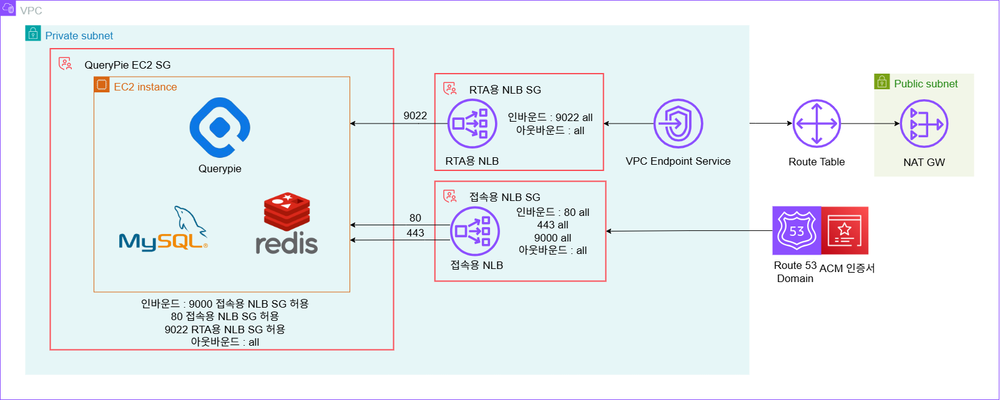

# AWS VPC 구성 리소스 요약 (QueryPie 환경)

이 문서는 제공된 아키텍처 다이어그램 기반으로 AWS VPC 내 리소스들을 카테고리별로 정리한 표입니다.

## 📦 VPC 및 서브넷

| 리소스 이름         | 설명                    |
|---------------------|-------------------------|
| securezone-dev          | 주요 VPC (Private 네트워크) |
| securezone-dev-pri-2a  | QueryPie EC2가 배치된 서브넷 |
| securezone-dev-pub-2a  | NAT Gateway 포함 서브넷 |

## 🖥️ 컴퓨트 (EC2)

| 리소스 이름      | 설명 |
|------------------|------|
| querypie-dev-2a    | m5.large, Amazon Linux 2023 |
| querypie-dev-proxy-sg  | 인바운드 포트 22, 80, 9000, 9022(RTA), source: 0.0.0.0/0 아웃바운드 포트 all, destination: 0.0.0.0/0|

## ⚙️ 네트워크 Load Balancer (NLB)

| NLB 종류       | 리스너(타겟그룹)                          |
|-------------------|-------------------------------|
| querypie-dev-rta-nlb(RTA) | tcp/9022(tg:querypie-dev-9022-9022) |
| querypie-dev-nlb(접속용) | tcp/80(tg:querypie-dev-443-80), tls/443(tg:querypie-dev-443-80 / TLS 인증서) tcp/9000(tg:querypie-dev-9000-9000) |

| 보안 그룹 이름         | 인바운드        | 아웃바운드 |
|------------------------|----------------------|------------|
| querypie-dev-rta-nlb-sg           | port: 9022  source:  0.0.0.0/0             | port: all destination: 0.0.0.0/0        |
| querypie-dev-nlb-sg          | port: 80, 443, 9000 source: 0.0.0.0/0    | port: all destination: 0.0.0.0/0       |

| vpc 엔드포인트 이름         | 설명 | 
|-----------------------|------|
| querypie-dev-rta-vpce-svc  | vpcendpointservice : RTA용 NLB에 연결됨, type:	 interface, az: ap-northeast-2|

## 🔒 보안 및 인증

| 리소스 이름          | 설명 |
|-----------------------|------|
| Route 53 Domain       | 접속용 NLB에 연결됨, url: querypie-dev.sec.lguplus.co.kr |
| ACM 인증서            | Route 53 도메인 연결 인증서, acm: sec.lguplus.co.kr |

## 🌐 라우팅 및 게이트웨이

| 리소스 이름         | 설명 |
|----------------------|------|
| Route Table          | 0.0.0.0/0 → NAT, local → local |
| NAT Gateway          | 인터넷 접속용 (Private Subnet용) |
| Internet Gateway     | Public Subnet용 |

